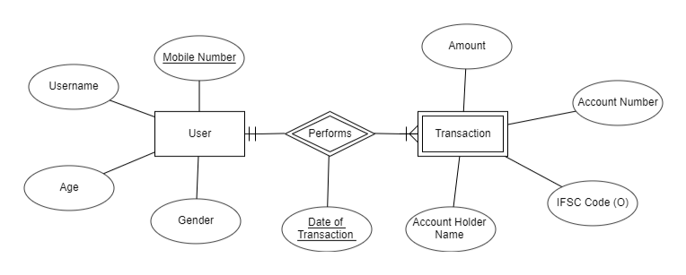

<!-- Improved compatibility of back to top link: See: https://github.com/othneildrew/Best-README-Template/pull/73 -->
<a name="readme-top"></a>

<!-- ABOUT THE PROJECT -->
# Yoga Classes Admission Form

## Overview
This repository contains the implementation of an admission form for monthly Yoga Classes. The implementation ensures that participants meet specific requirements for enrollment and outlines the key features of the admission process.

## Admission Requirements
To enroll for the monthly Yoga Classes, participants must meet the following requirements:
* <b>Age Limit:</b> Only individuals aged between 18 and 65 are eligible for enrollment.
* <b>Fee Structure:</b> Participants are required to pay the fees on a month-to-month basis, with a monthly fee of 500/- Rs INR.
* <b>Enrollment Period:</b> Participants can enroll on any day of the month but are obligated to pay for the entire month.
* <b>Batch Selection:</b> There are four batches available each day, scheduled at 6-7AM, 7-8AM, 8-9AM, and 5-6PM. Participants can choose any batch for a given month and have the flexibility to switch to a different batch in the following month. However, participants must remain in the same batch throughout a given month.
<p align="right">(<a href="#readme-top">back to top</a>)</p>

## Usage
To enroll for the Yoga Classes, follow these steps:
1. Fill the admission form provided in this repository. New users or existing users registering for the next month would be navigated to the Payments page if their details meet all the requirements mentioned 
2. Enter your bank account details in order to complete the registration. Note that the registration is not considered complete until the required amount is transferred.

<p align="right">(<a href="#readme-top">back to top</a>)</p>

## Built With
* [React](https://reactjs.org/)
* [Node.js](https://nodejs.org/en)
* [Express.js](https://expressjs.com/)
* [Mongoose](https://mongoosejs.com/)

<p align="right">(<a href="#readme-top">back to top</a>)</p>


<!-- Implementation Details-->
## Implementation Details
* The registration form is a simple form built using React that accept the details from user and make a call to REST API after performing appropriate validations on the client side.
* At the server end, the data coming from the client side is accepted after performing server side validations.
* The data is stored and fetched by establishing a connection to a remote mongoDB database.
* After the user details are properly verified, the user is prompted to proceed for payment to complete the registration.
* As soon as the user completes the payment, an API is called to insert the transaction data to the database. If there is some issue in transaction, the user details are restored in the database to maintain the atomicity of the transaction.



<p align="right">(<a href="#readme-top">back to top</a>)</p>

<!-- GETTING STARTED -->
## Getting Started

### Installation
1.  Clone the repo
   ```sh
   git clone https://github.com/your_username_/Project-Name.git
   ```
2. Install NPM packages for running the React App and ru
   ```sh
   cd frontend
   npm install
   ```
3. Install NPM packages for running the Node.js Server
   ```sh
   cd backend
   npm install
   ```

<p align="right">(<a href="#readme-top">back to top</a>)</p>

